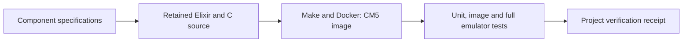

# Project guide

ElixirSSI is a stand-alone operating system built on the Erlang BEAM with
Elixir as its system language. It runs natively on Raspberry Pi Compute
Module 5 boards, and any number of them form one single-system-image cluster —
one process table, one filesystem, one scheduler, failover services, and a
remote cluster desktop — for computer-science users.

See the [architecture](architecture/elixirssi.md) (including how the cluster
is [watched from outside](architecture/elixirssi.md#watching-the-system-from-outside)),
the [CM5 emulation](architecture/cm5-emulation.md) that runs the flashable
image without boards, and the `components/elixirssi/component.md`.

Use [download and install](user/distribution.md) for release artifacts.

Start with [getting started](user/getting-started.md) for installation and usage.
See [active work](roadmap/active-work.md) for current development status.

## Development

This project is built with [Literate AI](https://github.com/NVIDIA-dev/literate-ai).
The [framework flow](user/framework-flow.md) explains the specification-led lifecycle,
and the [project map](user/project-layout.md) identifies the authority for a change.

Use `make verify-update` to qualify the image and `make verify` to check current
authority, source and image evidence. The [verification contract](user/framework-flow.md#verification-contract)
describes this project's suite and its physical-hardware boundary.

See [readable specifications](user/specifications.md),
[models and generation](user/models-and-generation.md),
[private test matrices](user/test-matrix.md),
[security](user/security.md), [skill boundaries](architecture/skills.md), and the
[authority learning loop](architecture/authority-learning-loop.md), the
[mission-specification map](architecture/mission-specification-composition.md), and the
[traceability rule](architecture/design-traceability.md) when those concerns apply.

Initialize from an organization or product repository with
`litai init PATH --from URL[#REVISION]`. Literate AI resolves every ancestor without
executing repository code, then records exact commits and inherited catalog provenance.
Use `litai update` to re-resolve that chain and `litai reparent URL|none` to review an
explicit parent change.
