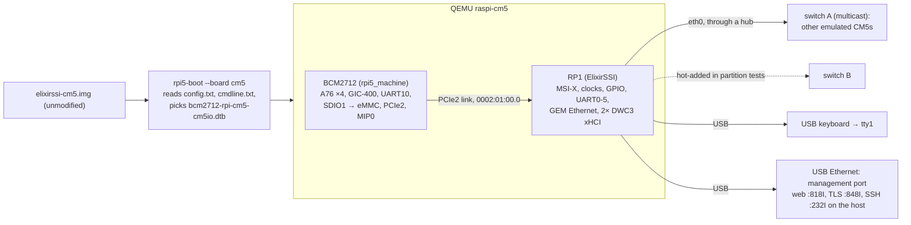

# Emulating the Compute Module 5

[Project guide](../README.md) → [ElixirSSI architecture](elixirssi.md) → CM5 emulation

ElixirSSI ships one artifact for real hardware: `elixirssi-cm5.img`, flashed to
a Compute Module 5's eMMC. Until now that image was checked statically
(`verify_cm5.py`) and its kernel and initramfs were run under QEMU/KVM's
generic `virt` machine. Neither runs the image the way a CM5 does. This
document describes an emulated CM5 that does: QEMU boots the unmodified image
from an emulated eMMC, through a model of the board's firmware, on models of
the BCM2712 SoC and the RP1 south bridge that were written from public
documentation. The approach follows the one the uConsole project took for the
CM4:
- pin an upstream emulator;
- add device models as reviewed patches;
- run the official image unmodified;
- state the fidelity of every device, so emulation is never taken as proof
  about silicon.

## Research and adoption decision

Research performed 2026-10-01.

| Candidate | Finding | Decision |
| --- | --- | --- |
| Upstream QEMU (v11.1.1) | Raspberry Pi models stop at the Pi 4B (BCM2711). No BCM2712, PCIe root complex or RP1. | Base QEMU, as pinned by rpi5_machine |
| [hatter6822/rpi5_machine](https://github.com/hatter6822/rpi5_machine) at `3548a76` (2026-09-28), GPL-2.0-or-later | An out-of-tree QEMU model of the Pi 5 Model B, shaped for upstreaming. Done: 4× Cortex-A76, GIC-400, UART10, system timer, watchdog/PM, RNG200, L2 interrupt controllers, GPIO, SD hosts, firmware mailbox and property channel, PCIe root complexes, MIP MSI controllers, and a script that boots SD card images as the Pi firmware does. Its RP1 milestone (M5) is planned in detail but not started. | **Adopted** and pinned. ElixirSSI adds the RP1 and the CM5. |
| Upstream Linux BCM2712 work | Device trees and drivers, not an emulator. | Used as documentation |

Building on rpi5_machine rather than writing a BCM2712 model means that
ElixirSSI's own patches cover only what the CM5 boot path needs and the base
lacks. Our RP1 model follows the register-level design that rpi5_machine's
plan sets out for it (`docs/PLAN.md`, WS7), so it can be offered back.

## Sources

| Document | Used for | SHA-256 |
| --- | --- | --- |
| [RP1 peripherals datasheet](https://datasheets.raspberrypi.com/rp1/rp1-peripherals.pdf) | Address map, atomic aliases (2.4), clocks (2.5), GPIO and pads (3.1), MSI-X translation (6.2), Ethernet configuration (7) | `87fb7b24e8d9add075b849d095a107827610c0409ea194785af624c1ea986c3d` |
| [CM5 datasheet](https://datasheets.raspberrypi.com/cm5/cm5-datasheet.pdf) | Onboard eMMC on CM5 versus an SDIO interface on CM5 Lite (2, 2.7); one Gigabit Ethernet port with its PHY (2.2) | `80070fefd8db6e8abc6e146c8b7b5fb318ba129cc1e28826936d547fde79c863` |
| [CM5 IO board datasheet](https://datasheets.raspberrypi.com/cm5/cm5io-datasheet.pdf) | The IO board's two USB 3.0 Type-A ports for keyboards and storage (3.4) | `4fd7f9edea384ccec4710943a886c5cd922dcdcd3b17f519325d3c70933f8f8e` |
| Raspberry Pi Linux `rpi-6.18.y`, the kernel ElixirSSI ships | `bcm2712-rpi-cm5-cm5io.dts` (eMMC on SDIO1, RP1 behind PCIe2). The reference implementations the datasheet points to: `drivers/mfd/rp1.c`, `drivers/clk/clk-rp1.c`, `drivers/pinctrl/pinctrl-rp1.c`, `macb`'s `raspberrypi,rp1-gem` configuration, `dt-bindings/mfd/rp1.h` | the pinned kernel tree |
| `lspci -vv` of RP1 on a Raspberry Pi 5 ([raspberrypi/linux#6471](https://github.com/raspberrypi/linux/issues/6471)) and a [linux-hardware.org probe](https://linux-hardware.org/?log=lspci&probe=2d03646368) | PCI class `0200`, BARs 16 KiB / 4 MiB / 64 KiB (32-bit, non-prefetchable) at PCI `0x410000` / `0` / `0x400000`, power management at 0x40, PCIe endpoint at 0x70, no subsystem ID | — |

## What runs



`scripts/ssi-cm5` runs N boards. Each board gets its own sparse copy of the
image as its eMMC, and a single RP1 Ethernet port on a shared switch with no
DHCP server, so the image's defaults fall back to link-local addressing as they
would on a bare switch. Each board also gets a USB keyboard and, for tests, a
USB Ethernet adapter (QEMU `usb-net`, bound by Linux's `cdc_ether` from the
image's own module set) on QEMU user networking, through which the host
reaches the board's web endpoint and SSH; the command line pins cluster
traffic to `eth0`. The Ethernet cable runs through a QEMU hub, so a test can
partition the cluster by hot-adding a second switch to some boards and
unplugging the first, without the boards seeing a link change. When the OS
reboots, `rpi5-boot` reads the card again, as the firmware does. Stopping a
board kills its firmware process and QEMU with it, which is a power pull, not
a shutdown.

## Fidelity

As in the uConsole plan, each device is reported at one of three levels:
1. **Surrogate:** behaves well enough for software to run.
2. **Driver contract:** the production Linux driver binds, and the device's
   observable registers, interrupts and DMA behave as the documentation and
   the driver require.
3. **Hardware:** checked against captures from a physical CM5. No device is at
   level 3 yet; that is [SSI-002](../roadmap/active-work.md).

| Device | Model | Level | Notes and gaps |
| --- | --- | --- | --- |
| Cortex-A76 ×4, GIC-400, timers | rpi5_machine | 2 | TCG only (GICv2 has no KVM path on this host); no timing fidelity |
| Firmware boot (`config.txt`, device tree, overlays, `cmdline.txt`) | rpi5_machine's `rpi5-boot` with `--board cm5` | 1 | Re-implements the closed firmware's documented behaviour. The `[cm5]` filter, board type 0x18 and the CM5 IO board's default tree are ours. |
| eMMC on SDIO1 | QEMU `emmc` on rpi5_machine's BCM2712 SDHCI | 2 | Fixed: QEMU's SDHCI lacked Auto CMD23, so every eMMC write hung. Not modelled: boot partitions, HS200/HS400 timing, CQE. |
| UART10 (debug console) | QEMU PL011 | 2 | |
| PCIe2 link, MIP0 | rpi5_machine | 2 | Linux trains the link (`link up, 2.5 GT/s x1`). Real hardware reports 5 GT/s x4. |
| RP1 PCI function | ElixirSSI `rp1` | 2 | Identity, class and BAR layout match lspci. The MSI-X capability's position (0xb0) and the table/PBA placement in BAR0 are this model's choice: the public lspci output stops before it. |
| RP1 interrupt translation (`MSIn_CFG`) | `rp1` | 2 | Edge and level (IACK) semantics from datasheet 6.2. Tested at register level and through Linux. |
| RP1 SYSINFO, clocks and PLLs | `rp1` | 2 for the registers `clk-rp1` uses | PLLs lock while powered; `SEL` reads 0 (the driver then uses `CTRL`). No frequency computation. |
| RP1 GPIO, RIO, pads | `rp1` | 2 | Function select, overrides, RIO loopback, edge and level events, `PCIE_INTE/INTS`. Peripheral functions other than RIO are not routed to pins. |
| RP1 UART0–5 | QEMU PL011 | 2 | UART0 (GPIO 14/15) is the system console. It is QEMU's third serial port, after UART10 and UARTA. |
| RP1 Ethernet | QEMU `cadence_gem`, revision `0x00020118` | 2 | Masters host memory through RP1's link (PCI `0x10_0000_0000`). The PHY is QEMU's generic one, not the board's Broadcom PHY. No PTP. |
| RP1 USB (2× DWC3, xHCI) | QEMU `usb_dwc3` | 2 | One USB 2 and one USB 3 port per controller, edge vectors 31 and 36. Fixed: DWC3 must latch `ERSTBA` on its low dword. MaxSlots (64) is not public. |
| RP1 SPI, I²C, PWM, I²S, ADC, PIO, DMA, SDIO, MIPI, mailbox | none | 0 | Read as zero and logged with `-d unimp` under the datasheet's block name. Unmodelled nodes are disabled in the tree, as rpi5_machine does for the SoC's unmodelled devices. |
| HDMI and display | none | 0 | The firmware framebuffer needs the BCM2712 DMA controller, which rpi5_machine has deferred. The tty1 shell is verified through `/dev/vcs1`. |
| Wi-Fi, Bluetooth, power button, LEDs | rpi5_machine where present | 1 | Not used by ElixirSSI |

## Discrepancies and defects found

Building and running the model turned up six findings worth keeping:
- **Atomic aliases of `PCIE_CFG`.** The datasheet (2.4) gives RP1's atomic
  aliases at +0x1000 (XOR), +0x2000 (set) and +0x3000 (clear). Linux's `rp1`
  driver, proven on hardware, writes `MSIn_CFG` through +0x800 (set) and
  +0xc00 (clear). The model honours both.
- **SDHCI Auto CMD23.** SD Host Controller 3.00 lets the host send
  `SET_BLOCK_COUNT` itself before a multiple-block command. Linux relies on
  that for eMMC, but QEMU's SDHCI neither implements it nor keeps the mode bit
  in `TRNMOD`. As a result the card waits for an open-ended write, and every
  write times out ("Card stuck being busy"). Fixed in
  `os/emulator/qemu/patches/0001`.
- **DWC3 and `ERSTBA`.** Linux writes the event-ring segment table base high
  dword first for DWC3 hosts (`XHCI_WRITE_64_HI_LO`), because Synopsys's
  controller latches it on the low dword. QEMU's xHCI latches on the high
  dword, which follows the xHCI specification's write order. It then reads the
  segment table from a stale address and halts with HCE, so no USB device ever
  enumerates. Fixed in `0003`.
- **xHCI slot count inside DWC3.** The default of the `slots` property does not
  reach an xHCI embedded in `usb_dwc3`, so it advertised one device slot, and
  QEMU's automatic hub used it up. The RP1 model sets the count explicitly.
- **Which UART is the console.** The guide said the shell is on the IO
  board's GPIO 14/15 UART, but the emulated firmware sent `console=serial0`
  to the debug UART. On a CM5, as on a Pi 5, `serial0` follows the device
  tree's `console` alias, which names UART10. That is the debug UART, whose
  connector the CM5 datasheet (2.8) says is not fitted on every module. The
  image's `config.txt` now sets `dtparam=uart0_console`, which moves the
  alias to RP1's UART0 on the 40-pin header, so the guide is true. The
  emulated boards use UART0 as their console and check that they do.
- **Serial console drain.** As with the `virt` runs, a console that nobody
  reads stalls the guest. The harness drains every board's console.

## Verification

| Test | What it shows |
| --- | --- |
| `make test-emulator` (`os/emulator/tests/test_rp1.py`) | RP1 at register level, with no OS: PCI identity and BAR sizes, `SYSINFO`, edge and IACK-level MSI-X delivery written to RAM through the root complex's inbound window, the SET/CLR and XOR/SET/CLR aliases, GPIO RIO loopback and pin interrupts reaching MSI-X, PLL lock, the GEM's identity, and unmodelled blocks reading zero |
| `make test-cm5` (`scripts/test_cluster.py --board cm5`) | Three emulated CM5s boot the unmodified image from eMMC. Linux sees a CM5 (model string, RP1 at `1de4:0001` rev 2 with lspci's BARs, `eth0` on `macb` with interrupts through `rp1_irq_chip`, eMMC, a USB keyboard). The boards then pass the whole cluster suite: membership, TLS, the aggregate machine, process table, shared files, `pmap`, failover after a power pull (about 9 s), rejoin with state kept on eMMC, SSH between boards, and typing on the USB keyboard into the tty1 shell. |

Under TCG on a 20-core arm64 host, three boards reach the shell in about
90 seconds, and the suite takes about two and a half minutes.

## Building and running

```sh
cd os
make emulator        # pinned rpi5_machine + QEMU + os/emulator, in build/emulator/
make test-emulator
make image-cm5       # the flashable image the boards boot
make run-cm5         # one board, console on this terminal
make cluster-cm5 N=3
make test-cm5
```

`os/emulator/build-qemu.sh` fetches the pinned base once. For each set of
inputs it prepares a source tree in a temporary directory: it applies
`base-patches/` to rpi5_machine, then the base's own series, then copies
`qemu/overlay/` and applies `qemu/patches/`. The tree is renamed into place
only when every step has succeeded. It never replaces the system QEMU. The
pins are in `os/emulator/pins.mk`.
