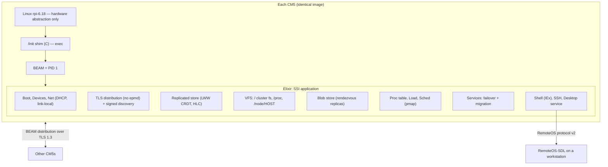
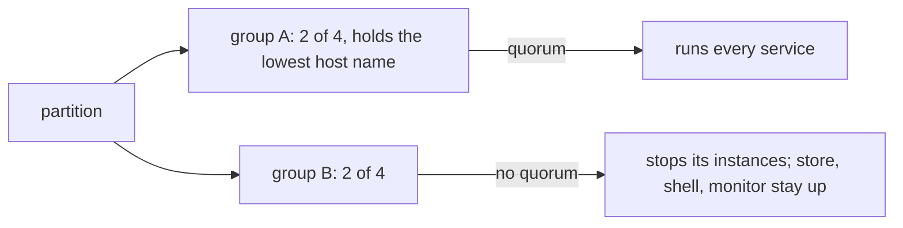
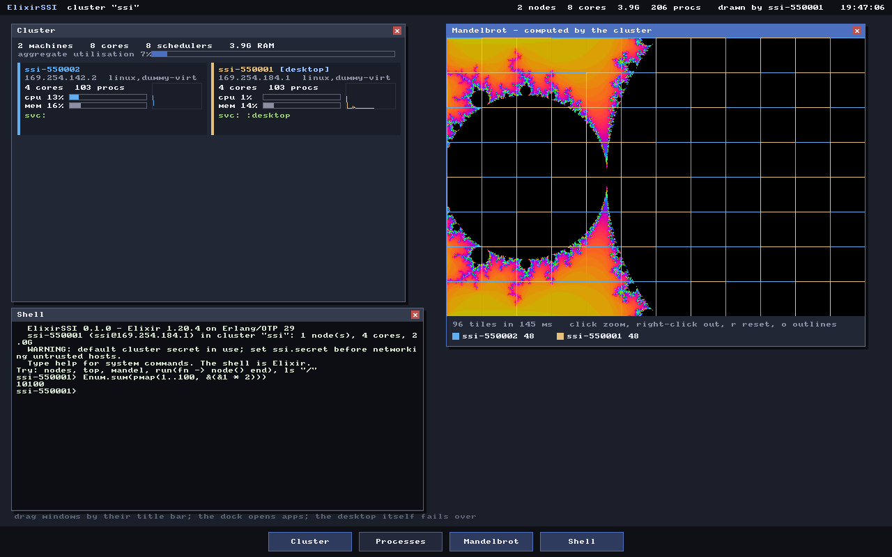
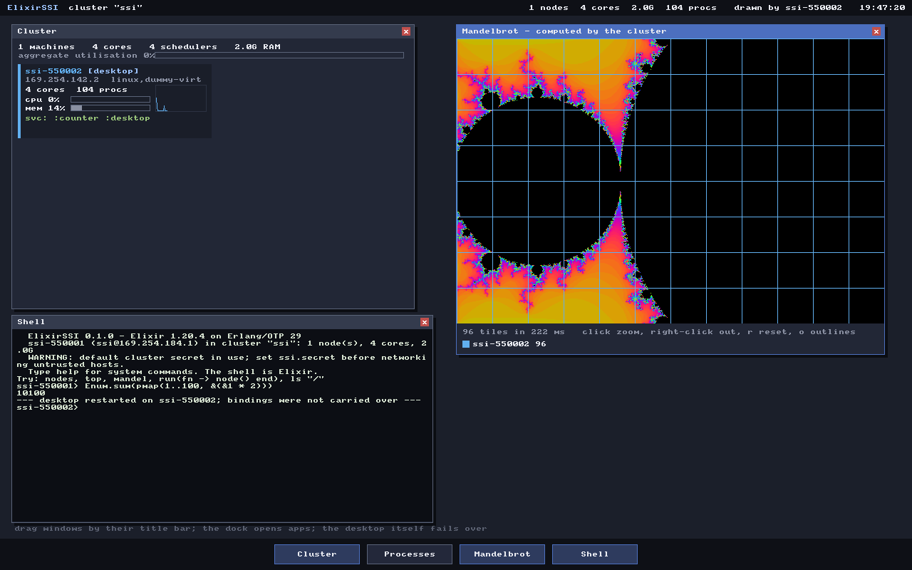
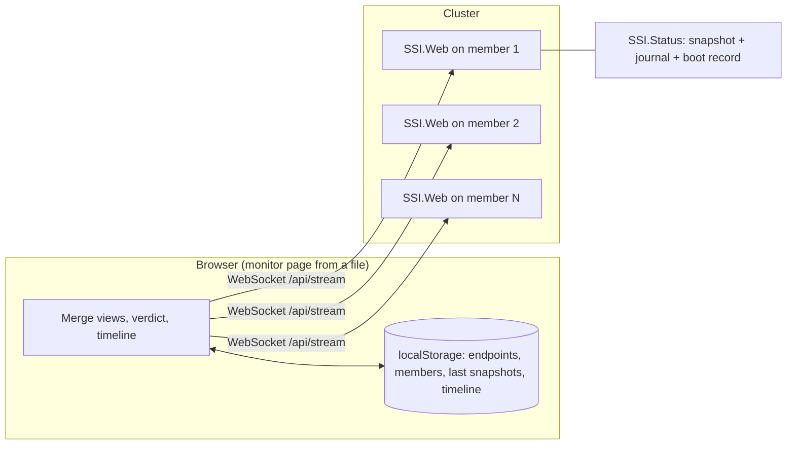
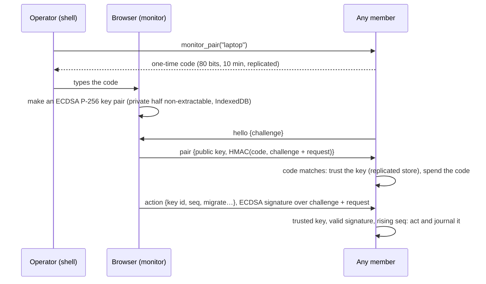

# ElixirSSI architecture

[Project guide](../README.md) → ElixirSSI architecture

ElixirSSI is an operating system in the lineage of PythonOS and RubyOS — a
language runtime that *is* the system rather than a program on one — with two
differences: it runs on real Raspberry Pi Compute Module 5 hardware, and any
number of those machines form a single system image. The behavioral contract
is `components/elixirssi/component.md`;
this document explains why it is built the way it is.

## Why Linux underneath, and nothing else from Linux

PythonOS and RubyOS run their interpreters on bare metal with a custom libc,
which works because QEMU's `virt` machine has simple virtio devices. A CM5 is
different: its Ethernet MAC is a Cadence GEM inside the RP1 south bridge,
reached over a PCIe link whose root complex, IOMMU and clocks need the
Broadcom/Raspberry Pi drivers; storage is an SDHCI eMMC controller with the
same dependencies. A bare-metal driver stack would have to reimplement all
of it, and when the project began, none of it could even be emulated. The
single-system-image value of the project lives entirely above the driver
layer. (An emulated CM5 now exists, built from public documentation; see
[CM5 emulation](cm5-emulation.md). It tests the image, but it is not a reason
to own those drivers.) ERTS also needs real threads, `mmap`, and a socket layer.

So the kernel is Raspberry Pi's own `rpi-6.18.y`, configured from
`bcm2712_defconfig` plus a small fragment, and treated strictly as a hardware
abstraction layer. There is no Linux userland: no shell, no init system, no
udev, no DHCP client, no epmd. A static C shim mounts the pseudo filesystems,
attaches the console and *execs* the BEAM, so the BEAM is PID 1. Everything a
user can observe is Elixir. The C surface is two files: the shim and one NIF of
policy-free system calls.

The same kernel image boots the CM5 and the QEMU/KVM `virt` machine (the
fragment adds virtio and the generic PCI host), so the system that is tested
under KVM is bit-for-bit the one that ships, except for the device tree.

## Boot

`ssi_init` → `erlexec` → BEAM → `SSI.Application.start/2`, whose
`SSI.Boot.run/0` quiets kernel console logging, loads drivers for every sysfs
`modalias` that matches the initramfs's `modules.alias`, mounts the FAT boot
partition read-only (re-reading `ssi.conf` from it), mounts the ext4 data
partition (or a volatile tmpfs), names the machine from its MAC address, and
writes `/etc/hosts` and the shell's `.iex.exs`. The supervision tree then
starts, in dependency order: networking, distribution, load sampling,
membership, the store, blobs, the filesystem, discovery, services, SSH, and
the console banner. Under KVM a node reaches its prompt about three seconds
after the BEAM starts.

## Forming one system

**Names and transport.** Each node is `ssi@<cluster-ip>`. Distribution
listens on a fixed port, so `SSI.Cluster.Epmd` answers name lookups
arithmetically and no epmd daemon exists.

**Trust.** Operators provision one secret. The distribution cookie, the
discovery HMAC key and a cluster certificate authority are all derived from
it, so there are no per-node credentials, and the same image can be flashed
to every Pi. Distribution runs over TLS 1.3 with mutual verification: at boot
each node issues itself a certificate for a fresh key, signed by the CA key.
The CA certificate must be *byte-identical* on every node, because a peer
sends its copy during the handshake and the receiver only accepts it as the
trust anchor if it matches its own; so the CA uses an Ed25519 key (whose
signatures are deterministic) with a fixed serial and validity. An earlier
variant with a randomly signed ECDSA CA passed in-process handshake tests and
failed between real nodes with `invalid_issuer`; `tls_test.exs` now checks
real `inet_tls` peers.

**Discovery.** Signed multicast beacons every two seconds (plus optional
unicast seeds). Beacons are verified before being decoded, and decoded with
`binary_to_term(_, [:safe])`. When a node joins, `SSI.Cluster` connects to
every member the joined node knows, which makes the mesh complete
immediately rather than eventually.

**Failure detection.** Distribution ticks (`net_ticktime 8`) detect a dead
member in about 8–10 seconds; measured service failover after killing a VM is
9–10 seconds.

## State: a CRDT, not a consensus log

The system's shared state (file metadata, service specifications and
checkpoints, the SSH host key, authorised keys) is a last-writer-wins map
replicated in full to every node. Timestamps are hybrid logical clocks
`{wall_ms, counter, node}`, so merge is a pure max per key: commutative,
associative and idempotent. Writes are pushed to all members; anti-entropy
(per-bucket digest exchange every five seconds and on join) repairs anything
the pushes missed, including writes made on both sides of a partition. Each
node keeps an append-only log on its data partition and replays it at boot.

The alternative — Raft or Mnesia majority transactions — would give
linearisable writes at the cost of availability whenever a majority is
unreachable, and would make a single Pi on a desk unusable once it had ever
been in a cluster. For an operating system's metadata, always-writable with
deterministic conflict resolution is the better trade. The cost is the usual
CRDT one: concurrent writes to one key resolve to one of them.

## Files

Metadata in the store means every node lists and stats the whole tree
locally. Content is chunked (1 MiB) and stored as SHA-256-named blobs on
`replicas` nodes chosen by rendezvous hashing, which needs no placement table
and moves only the blobs a joining node now ranks highest for. Membership
changes trigger repair; unreferenced blobs are collected after ten minutes.
`/proc` renders the live cluster as files; `/node/HOST/...` runs file
operations on that member, for the cases (its `/boot`, its `/sys`) where
location matters.

## Processes, scheduling and services

BEAM pids are already location-transparent, so the cluster-wide process
table is a fan-out of `Process.list/0`, and `kill` works across machines
unchanged. `SSI.Load` gossips scheduler utilisation measured exactly from
`scheduler_wall_time` once a second; `SSI.Sched` uses it to place work and to
farm collections across every scheduler in the cluster, re-reading
membership on each dispatch (new nodes take work mid-run) and re-queuing items
whose node fails.

Long-lived system functions are *services*: a service runs on its pinned
member or the member ranking highest for its name. Every node computes that
same function and starts or stops its local instances accordingly — no
leader. A migrating service's new instance waits until the old one has
stopped, so it restores the final checkpoint. A freshly booted node waits a
settle period before claiming services, so a rejoining Pi does not briefly
run duplicates.

### Services under partition: quorum

Membership is the connected set, so after a network split each group sees a
smaller but internally consistent cluster and, by the rule above, would run
every service: the one system becomes two, each acting on the world (driving
the desktop, writing checkpoints) as if alone. Only a group that knows how
big the cluster *should* be can tell it is the minority. That is the
*roster* (`SSI.Cluster.Roster`): every member the cluster has had, kept in
the replicated store, keyed by host name because node names follow
addresses that DHCP may change.

A group holds quorum with more than half of the roster, or exactly half
including the roster's lowest host name, so of two equal halves exactly one
continues. Without quorum, a service has no owner and every manager in the
group stops its instances, journalling `quorum lost`; when the partition
heals, or an operator forgets a retired member (`cluster_forget`), quorum
returns and the services start again from their checkpoints. Only services
are fenced: the store is a CRDT and the shell, files and status endpoint
keep working in every group, which is what makes the fenced half
diagnosable from the monitor.

This is fencing by self-knowledge, not a lease. Each side detects the split
on its own distribution tick, so an instance on the losing side may outlive
the winner's new instance by the difference between the two detections
(bounded by the 8 s tick timeout, usually far less). A two-member cluster
gains nothing from quorum: it cannot tell a partition from a failure, so
quorum would only turn the tie-breaking member's failure into the loss of
every service. The default policy, `services.partition = auto`, therefore
requires quorum from three remembered members on; `quorum` and `available`
(each group runs its own instances, the earlier behaviour) force either.

## Consoles

The serial console is the BEAM's own terminal. A second shell runs on the
first virtual console: `SSI.Sys.open_tty/1` opens `/dev/tty1` in cooked mode
(the kernel's line discipline does editing and echo), the descriptor becomes
an Erlang fd port, and `SSI.Console.IOServer` implements the Erlang I/O
protocol over it, so IEx and everything it evaluates read and write the
display and keyboard like any other terminal.

## The desktop

The desktop follows the RemoteOS-SDL design: the guest owns the scene, the
host owns the window. It is itself a service, so it has no fixed home: kill
the Pi drawing it and another Pi restarts it, restores the window layout and
each application's state (Mandelbrot view, shell history), reconnects, and
the menu bar's "drawn by" changes. Applications do their heavy work through
`SSI.Sched`; the Mandelbrot outlines every tile in the colour of the machine
that computed it, so the scheduler's decisions are visible.

After the node drawing it is killed, another node restarts the desktop with
the same zoomed view and shell history:

## Watching the system from outside

A single system image is two things at once: what it presents (one machine
with N cores, one service list, one process table) and what implements it (N
boards that boot, fail, and drift apart). The monitor shows both, and a
third thing between them: the timeline of joins, departures, failovers and
boots, which is where the single-machine illusion is either maintained or
lost.

The monitor must be outside the cluster, because a status page the cluster
serves vanishes exactly when it is needed. A browser can only speak HTTP and
WebSocket, whether the page is JavaScript or WebAssembly, so the language of
the page is not what keeps it alive; where it is loaded from is. The monitor
is therefore one self-contained HTML file that runs from disk, and the
cluster side is an endpoint on every member rather than a
singleton service. A service lives on one member and has to be found again
after it moves; every member, on the other hand, already holds the
cluster-wide data the snapshot is built from (membership, gossiped load
samples, the replicated service table), so any member gives the same answer
from local memory.

Connecting to every member at once is what makes degraded states visible:

| What the browser observes | Verdict |
| --- | --- |
| Every remembered member is in the answering members' memberships and every service runs | Healthy |
| A remembered member is in no answering member's membership, a service is not running, or the answering members lack quorum | Degraded |
| Two answering members report different memberships for more than 10 s | Split (no single member can report its own partition reliably), naming the group that holds quorum and the fenced one |
| Nothing answers | Down, with the last known state and when each member was last heard |

What a browser cannot tell apart is listed in the monitor rather than
guessed at: a connection refused within a second means something reachable
is not serving (a board booting, or the forwarder of an emulated board with
the board gone); a connection that does not complete in four seconds means
off, disconnected, or not routable from this browser. "Kernel up, BEAM down"
is not a lasting state: the BEAM is PID 1, so its death panics the kernel
and the board reboots. Each member therefore records on its data partition
how its previous boot ended, and reports it when it returns, so the monitor
can say whether a member went away cleanly (restart or power-off) or not
(power loss, panic, BEAM failure) and when it was last alive.

### Acting on the system

Reaching the endpoint is enough to read the status, never to change it. The
cluster has one shared secret and no user accounts, and the secret must not
go into a web page: it is the root of distribution, discovery and the TLS
CAs. So an operator's authority comes from somewhere the system already
trusts — being able to log in on a console or over SSH — and is handed to
a browser once:

Every request is signed over the connection's random challenge with a
sequence number that must rise, so it cannot be forged, altered or replayed,
even over plain HTTP; the code itself never crosses the network. TLS is
still offered on every member (`web.tls_port`), for confidentiality and so
the browser knows it is talking to the cluster. Its certificates come from a
*web CA* separate from the distribution CA, because browsers do not accept
Ed25519 in certificates; its P-256 key is derived from the secret like
everything else, so it needs no storage and survives any restart, and each
member's certificate names its host name and current addresses.

Browsers allow signing keys only in secure contexts, which a page opened
from a file is and a page served over plain HTTP is not; the monitor served
over HTTP is therefore read-only, and from a file or over HTTPS it offers
controls once paired. A key is withdrawn with `monitor_revoke`, which every
member honours at once because snapshots carry the trusted key ids.

## Verification

| Layer | How it is verified |
| --- | --- |
| Pure logic | ExUnit unit tests on the host |
| Distributed behavior | ExUnit with real peer BEAMs (`:peer`), each running the full application |
| The shipped kernel + initramfs | `make test-cluster`: QEMU/KVM VMs on a virtual switch, driven through their serial consoles; VMs are killed and restarted |
| Desktop | `make test-desktop`: headless RemoteOS-SDL, injected input, captured frames, desktop failover |
| CM5 image | `verify_cm5.py`: partition layout, boot files, kernel header, and driver coverage of every device in the CM5 device trees |
| CM5 hardware models | `make test-emulator`: the emulated RP1 at register level, with no OS |
| The flashable image on emulated CM5s | `make test-cm5`: three emulated CM5 boards (BCM2712 + RP1, [CM5 emulation](cm5-emulation.md)) boot `elixirssi-cm5.img` from eMMC through a model of the firmware and pass the cluster suite |
| The monitor | `make test-monitor`: a headless browser runs the monitor page from a file against four emulated CM5 boards, through power pulls, a partition and its heal, and the whole cluster going down and coming back; then a second browser connects over TLS (certificates verified against the web CA), is refused without a key, pairs, moves a service, restarts and powers off members, and loses control on revocation |

A lesson from the VM tests applies to real hardware: a serial console nobody
drains stalls the guest. When the UART's consumer stops reading, kernel
console writes and the BEAM's logger block, and the node drops out of the
cluster. The test harness therefore drains every console continuously; on a
CM5, leave the debug UART either disconnected or read.

## Limits and next steps

- The cluster filesystem writes whole files (last writer wins); it is not a
  POSIX block device, and there is no byte-range locking.
- Under a partition only the group holding quorum runs services, but
  fencing is not a lease: instances on both sides may overlap for the
  difference between the two sides' failure detections. A member retired for
  good counts against quorum until it is forgotten (`cluster_forget`), and a
  member without a persistent store that boots cut off from the rest knows
  only itself.
- Anyone holding the cluster secret is a full member; there is no per-user
  or per-node revocation short of changing the secret on every node.
  Monitor keys are revocable individually, but a paired browser has every
  control; there are no roles.
- The monitor's TLS needs its web CA imported into the browser or operating
  system by hand; a browser's own trust store cannot be provisioned from the
  cluster.
- The `tty1` shell (HDMI and USB keyboard) is verified on the shipped kernel
  under QEMU with a virtual keyboard; on a CM5 it relies on the simple
  framebuffer the Pi firmware provides, which awaits hardware validation.
- Emulated CM5s now run the flashable image itself, but they model devices
  at the driver-contract level, not silicon (see the fidelity table in
  [CM5 emulation](cm5-emulation.md)). Hardware validation on physical CM5s
  remains the evidence gap; see [active work](../roadmap/active-work.md).
