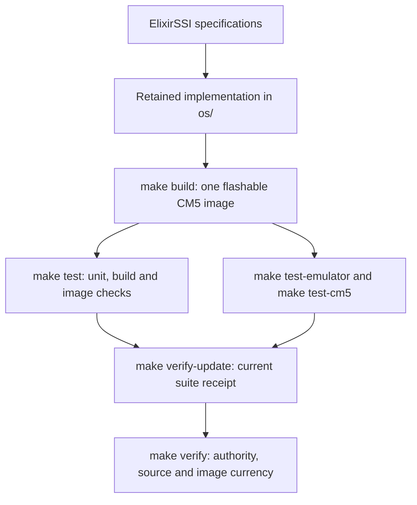

# Framework flow

[Project guide](../README.md) → framework flow

ElixirSSI uses Component specifications as behavioral authority and retains its
reference implementation under `os/`. Change the owning specification and source
together. Make and Docker build the Linux/Elixir system image; the Standard
Python greeting example is a separate framework demonstration.

Use `make build`, `make run`, `make test`, and `make clean` for everyday work.
`make run` boots the flashable image in the full CM5 emulator. Docker supplies
Linux tools on macOS; see [getting started](getting-started.md).

## Verification contract

`make verify-update` runs four required stages in order: `make build`, `make test`,
`make test-emulator`, and `make test-cm5`. It removes any previous receipt before
execution and publishes a replacement only after all four succeed and authority
and source remain unchanged. The receipt counts four command stages, not four
individual assertions. The default tests also exercise the verification runner's
failure, source-drift, image-drift and publication boundaries.

The project-owned runner is content-pinned in `literate.project.json`.
`verification/current.json` uses Literate AI's compact project test receipt
contract. `verification/system-image.json` records source identities, command
results, log identities and the two image identities. Detailed logs remain under
`os/build/logs/verification/`; they can contain local execution details and are
not committed. This suite does not claim Standard generated-source admission,
a generated-source SBOM/security scan, or physical-device qualification.

`make verify` checks retained source (including new unignored source files), the
runner pin, the recorded suite, and the built images, then runs `litai verify`.
**Use this combined gate for ElixirSSI.** Standalone `litai verify` validates
framework authority, resolution and the compact receipt; it does not recompute
our retained-source or image fingerprints. After `make clean` or in a fresh
checkout, run `make verify-update` to rebuild and qualify local artifacts.
A source, runner, specification or image change requires a new passing run.
Review runner changes before updating its SHA-256 policy pin; verification never
automatically authorizes a changed runner.

The configured Standard lifecycle and Python/Make/pip/Linux Flavor defaults are
retained for `samples/hello-component`, whose slots consume those defaults.
The ElixirSSI specifications have no such slots, and those defaults do not describe
or build the operating system. The default Component is `components/elixirssi`;
`litai rebuild` is not the OS build entry point. Do not overwrite the OS receipt
with the greeting example's generation results.

See the [project map](project-layout.md) for ownership and
[security](security.md) for generated-code execution guidance.
