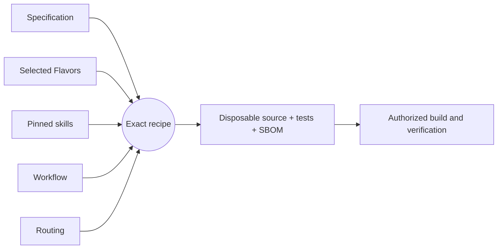

# Getting started

[Project guide](../README.md) → getting started

## What is ElixirSSI?

ElixirSSI is a stand-alone operating system whose runtime is the Erlang BEAM
and whose system language is Elixir. It boots natively on Raspberry Pi
Compute Module 5 boards, and every CM5 running it on the same network joins
one **single system image**: one shell sees every machine's processes, one
filesystem tree spans their disks, computation spreads over all their cores,
and system services — including a remote graphical desktop — survive the loss
of any one machine. It is built for computer scientists who want a cluster
that behaves like one machine. See the [architecture](../architecture/elixirssi.md).

## Host prerequisites

- Linux with Docker, `make`, `git`, `python3`, `curl`, `mkfs.ext4`, and QEMU
  (`qemu-system-aarch64`). Debian/Ubuntu: `apt install qemu-system-arm
  e2fsprogs build-essential bc flex bison libssl-dev libelf-dev`.
- An arm64 host with `/dev/kvm` runs the VMs at native speed. On x86-64, also
  install `gcc-aarch64-linux-gnu` and `qemu-user-static` (binfmt for the arm64
  builder image); VMs then run emulated and several times slower.
- About 15 GB of disk for the kernel tree and builds.
- For the desktop: [RemoteOS-SDL](https://github.com/jordanhubbard/RemoteOS-SDL)
  built on the workstation that will show it.

## Build

```console
cd os
make            # toolchain image, kernel, release, initramfs (first run ~25 min)
make test       # host test suite: unit + multi-node tests with real peer BEAMs
```

`make` fetches pinned, checksummed Erlang/OTP 29.1.1 and Elixir 1.20.4 sources
and the Raspberry Pi `rpi-6.18.y` kernel. Outputs land in `os/build/`:
`kernel/arch/arm64/boot/Image` and `ssi-initramfs.cpio.gz`.

## Run under QEMU

```console
make run                 # one node; the serial console is your terminal
make cluster N=3         # three nodes on a virtual switch; you get node 1's console
```

Quit QEMU with `Ctrl-A X`. In cluster mode the other nodes keep running
headless; stop them with `scripts/ssi-qemu stop`. Node *I* forwards SSH to
`localhost:222I` (password `elixir` in development):

```console
ssh -p 2222 root@localhost
```

At the prompt (`ssi-550001(1)>`), the shell is Elixir with system commands:

```elixir
help                       # command summary
nodes                      # every machine: cores, memory, load, temperature
cluster                    # the aggregate machine
ps name: "SSI"             # processes on all machines, as HOST:<0.N.0>
write "/home/hello", "hi"  # visible at once from every node
cat "/proc/cluster"
pmap 1..1000, fn i -> {i, node()} end
mandel                     # ASCII Mandelbrot; each row computed somewhere else
bench                      # one core versus the whole cluster
SSI.Service.register(:counter, SSI.Demo.Counter)
SSI.Demo.Counter.inc()     # from any node; survives losing the one running it
```

Verify a whole cluster automatically (boots VMs, kills one, restarts it):

```console
make test-cluster
```

## The cluster desktop

On the workstation, start RemoteOS-SDL listening for the cluster:

```console
remoteos-sdl --listen-tcp 0.0.0.0:17010
```

Under QEMU, start the cluster with the desktop pointed at the host (QEMU's
user network reaches it as 10.0.2.2):

```console
scripts/ssi-qemu cluster 3 10.0.2.2:17010
```

On real hardware set `desktop = WORKSTATION-IP:17010` in `ssi.conf`, or run
`desktop "192.168.1.10:17010"` at any node's shell. The desktop opens a
Cluster monitor, a Mandelbrot computed by every machine (tiles outlined in
each machine's colour; click to zoom), and an Elixir shell window. Power off
the machine named in the menu bar's "drawn by" field: the desktop reappears
from another machine with the same windows. `make test-desktop` checks all of
this against a headless RemoteOS-SDL.

## Watch the cluster

Every member serves a status endpoint on port 80 (`web.port`) and over TLS
on port 443 (`web.tls_port`). The
monitor is one HTML file, `os/ssi/priv/monitor/index.html`; open it from disk
so it keeps working when members, or the whole cluster, are down, and point
it at one or more members:

```text
file:///path/to/index.html#endpoints=192.168.1.21:80,192.168.1.22:80
```

You can also browse to any member (`http://MEMBER/`) and save the page. The
monitor connects to every endpoint you give it, remembers the cluster in the
browser, and shows one verdict with its reasons: **Healthy**, **Degraded** (a
member missing or a service not running), **Split** (members disagree about
the membership), or **Down** (nothing answers; the last known state stays on
screen). It also shows the system as one machine, a card per member
(including how its previous boot ended: cleanly, or by power loss or a
crash), the services, and a timeline of joins, departures, failovers and
boots.

### Act on the cluster from the monitor

Reading needs nothing; acting needs this browser to be paired. In a shell on
any member (console or SSH):

```text
monitor_pair("laptop")
```

prints a one-time code, valid for ten minutes. Enter it under **Control** in
the monitor. The browser makes a key pair whose private half cannot be
copied out of it, and the cluster trusts that key from then on: each member
card gets **restart** and **power off** (each asks for confirmation in the
page), and each service a **move** to another member. Every action appears
in the timeline with the name you paired under. `monitor_keys` lists paired
browsers and `monitor_revoke("laptop")` removes one.

Controls need the page opened from a file or over `https://`; served over
plain HTTP it stays read-only, because browsers allow signing keys only in
secure contexts.

To use TLS, trust the cluster's web CA once in your browser or operating
system: download it from any member (`http://MEMBER/ca.pem`), check its
public-key fingerprint against what `monitor_ca` prints in a shell, and
import it as a certificate authority. Then give endpoints as
`https://MEMBER` (or browse to `https://MEMBER/`). Every member's
certificate names its host name, its addresses, and `localhost`, so an SSH
tunnel or port forward verifies too.

Under QEMU, node *I*'s endpoint is forwarded to `localhost:808I` and its TLS
endpoint to `localhost:844I`; on emulated CM5 boards to `localhost:818I` and
`localhost:848I`. `make test-monitor` runs the monitor in a
headless browser against four emulated CM5s through a power pull, a clean
restart, a partition and its heal, and the whole cluster going down and
coming back, then pairs a second browser over TLS and uses every control
(`BOARD=virt` uses KVM nodes and takes minutes, not a quarter of an hour).

## Install on Raspberry Pi Compute Module 5

1. Build the image. Every node of a cluster can use the same image; the
   generated cluster secret is kept in `os/build/cm5/cluster.secret` and
   reused for later images.

   ```console
   cd os
   SSI_CLUSTER=lab SSI_DESKTOP=192.168.1.10:17010 \
   SSI_AUTHORIZED_KEYS=keys.pub make image-cm5   # keys.pub: a file under os/
   python3 scripts/verify_cm5.py                    # layout and driver coverage
   ```

   The result is `os/build/cm5/elixirssi-cm5.img` (and `.img.zst`): a FAT32
   boot partition and a 2 GiB ext4 data partition (`SSI_DATA_MB` changes it).

2. Flash each CM5. For eMMC models, fit the CM5 to its IO board, set the
   *disable eMMC boot* jumper (or press nRPIBOOT), connect USB-C to the host
   and run Raspberry Pi's `rpiboot -d mass-storage-gadget64`; the eMMC appears
   as a USB disk. For CM5 Lite, use an SD card. Then:

   ```console
   zstd -dc os/build/cm5/elixirssi-cm5.img.zst | sudo dd of=/dev/sdX bs=4M conv=fsync
   ```

   Raspberry Pi Imager's "Use custom" option also accepts the uncompressed `.img`.

3. Connect every CM5 to one Ethernet switch and power them on. A DHCP server
   is optional: without one, nodes use link-local addresses. They find each
   other within seconds. A shell is available on the IO board's GPIO 14/15
   UART at 115200 baud, on an HDMI display with a USB keyboard, and over SSH
   on every node.

4. Add capacity later by flashing the same image to another CM5 and plugging
   it in. Remove a node by powering it off (`poweroff "ssi-1a2b3c"` from any
   shell stops its services first); its services move and its file blocks are
   re-replicated.

## Try it on emulated CM5 hardware

No boards yet? `os/emulator/` builds a QEMU that emulates the CM5 (BCM2712
and RP1, modelled from public documentation; see
[CM5 emulation](../architecture/cm5-emulation.md)). It boots the image you
would flash:

```console
cd os
make emulator           # pinned QEMU build, ~2 min after the first fetch
make image-cm5
make run-cm5            # one board; its UART0 console is your terminal (Ctrl-A X quits)
make cluster-cm5 N=3    # three boards on one switch, with no DHCP server
make test-cm5           # the cluster acceptance suite on three boards
```

Each board boots its own copy of the image from eMMC
(`os/build/cm5emu/nodeI.img`). It has one Ethernet port on a shared virtual
switch, a USB keyboard, and a USB Ethernet adapter as a management port
(web endpoint on `localhost:818I`, SSH on `localhost:232I`);
`scripts/ssi-cm5 stop` pulls the power. Emulation
runs without KVM, so boards take about a minute and a half to reach the
shell. It shows that the image and the OS work on the modelled hardware; it
does not replace a run on real CM5s.

## Configuration

`ssi.conf` on the boot partition (template: `ssi.conf.example`, also in
`os/boot/cm5/`) or `ssi.KEY=VALUE` on the kernel command line:

| Key | Default | Meaning |
| --- | --- | --- |
| `cluster` | `ssi` | Cluster name; nodes join only their own cluster |
| `secret` | insecure default | Shared secret; derives the cookie and beacon key |
| `net.IFNAME` | `dhcp,linklocal` | Address policy per interface |
| `cluster_if` | first configured | Interface carrying cluster traffic |
| `peers` | none | Unicast discovery seeds |
| `replicas` | `2` | Copies of each file block |
| `desktop`, `desktop.size` | off, `1280x800` | RemoteOS-SDL endpoint for the desktop |
| `ssh.port`, `ssh.password` | `22`, off | SSH server; keys from `/boot/authorized_keys` |
| `web.port` | `80` | Status endpoint for the monitor (`0` disables it) |
| `web.tls_port` | `443` | The same endpoint over TLS, with a certificate from the cluster's web CA (`0` disables it) |
| `data`, `boot` | `auto` | Devices for `/data` and `/boot` (`tmpfs`/`none` to disable) |
| `console.tty` | `tty1` | Virtual console that gets a shell (`off` to disable) |

## Clean up

`scripts/ssi-qemu stop` stops background VMs; `make clean` removes build
outputs but keeps downloads and the kernel tree; deleting `os/build/` removes
everything, including VM data disks.

---

## Development workflow

This project uses [Literate AI](https://github.com/NVIDIA-dev/literate-ai) to
keep specifications as durable authority and generate source, current tests, and a
CycloneDX source SBOM into a disposable workspace. The commands below are for
contributors, not end users.

Validate the project and inspect the exact recipe (planning does not invoke a
model or execute generated code):

```console
litai project validate
litai lock --check
litai plan samples/hello-component
```

Every non-empty initialized project begins with a portable hello Component. With an
authenticated coding CLI and the selected host toolchain, prove the complete local
lifecycle before changing it:

```console
litai rebuild samples/hello-component --project . \
  --allow-host-execution --update-receipt
```

The rebuild generates source and current tests from the specification, builds a
runnable artifact, runs both generated and independent acceptance tests, executes the
application, and commits the compact current passing receipt. Modify
`samples/hello-component/component.md` to begin the first application, or use
`litai init --empty` when no starter is wanted.

Invoke the `Execute:` command printed by rebuild with `{"name":"LitAI"}` as its one
argument. The known output is exactly
`{"greeting":"Hello, LitAI!","name":"LitAI"}`.



`+flavor` selects a variation and `-flavor` removes one. Explicit Component and
Flavor requirements outrank defaults, so `-bazel` removes the scaffold's Bazel
preference before prompt assembly. Read the [framework flow](framework-flow.md) before
adding a lifecycle driver that compiles or runs generated source, and use the
[project map](project-layout.md) to change the owning artifact.
